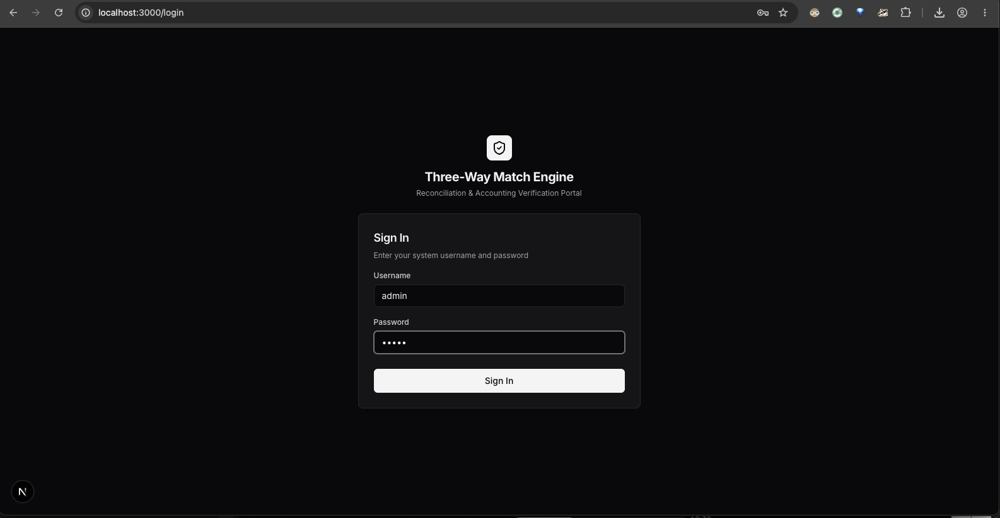
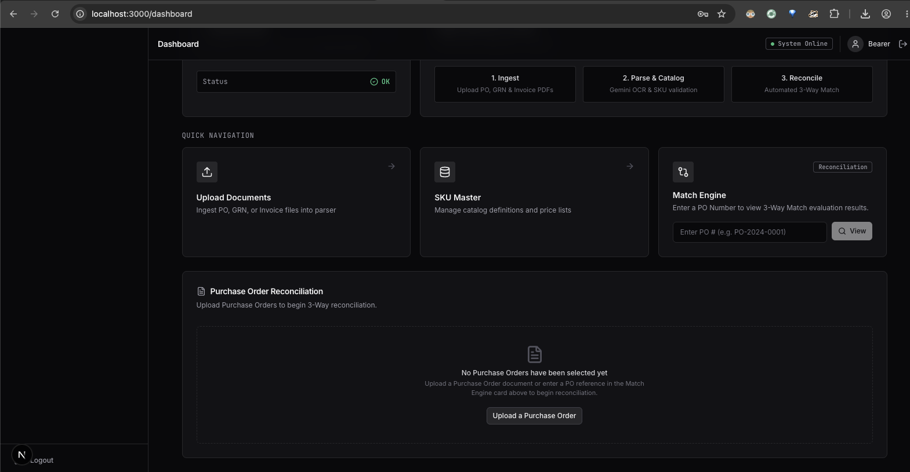
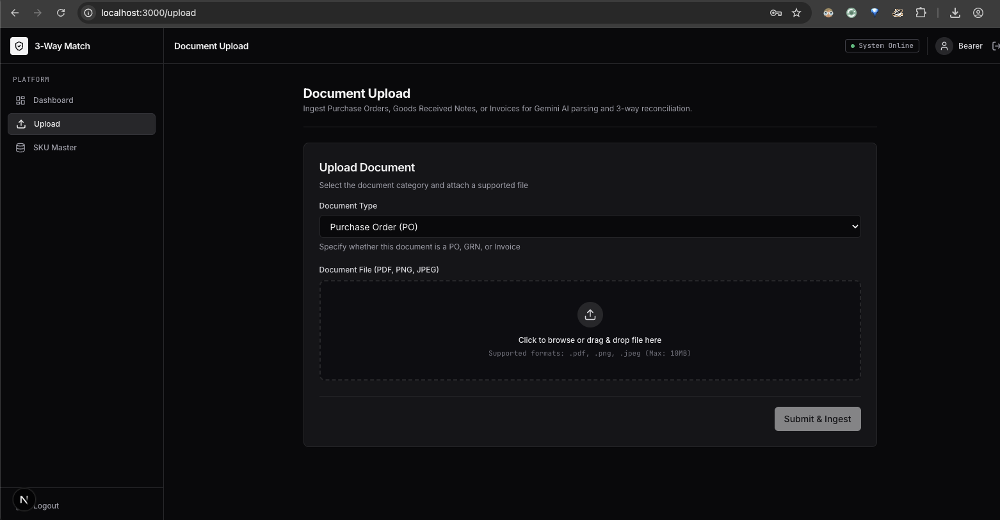
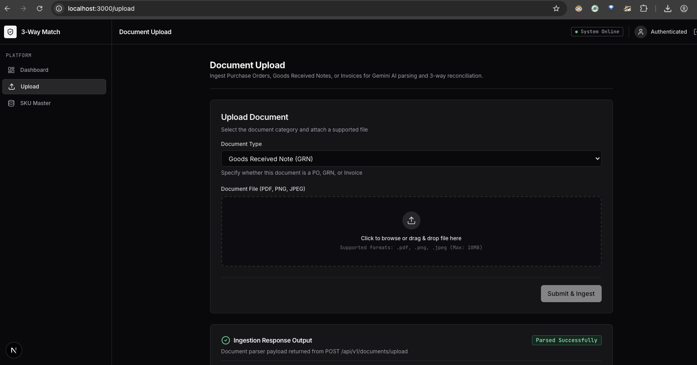
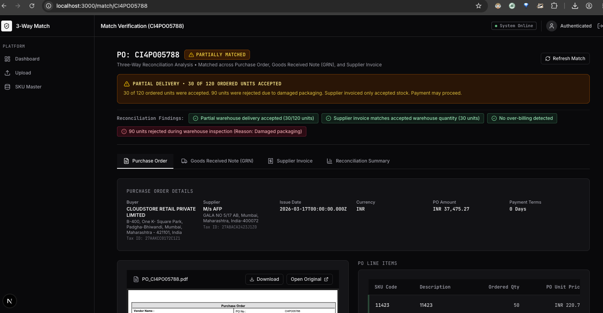
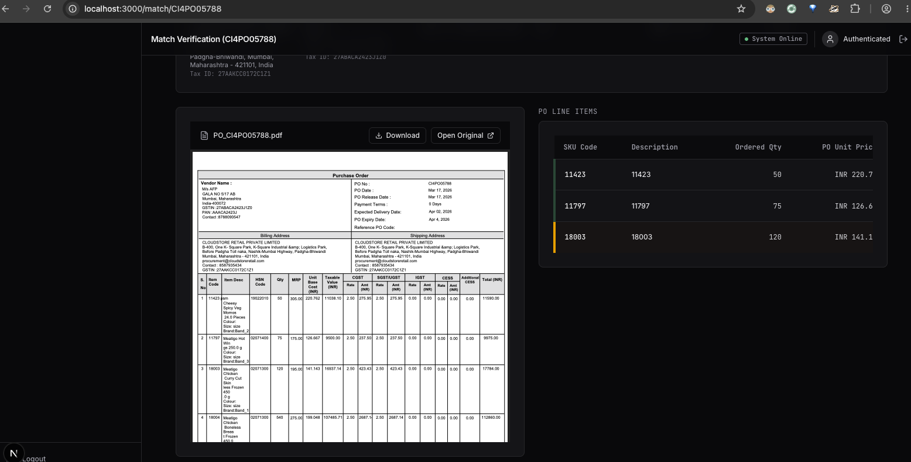
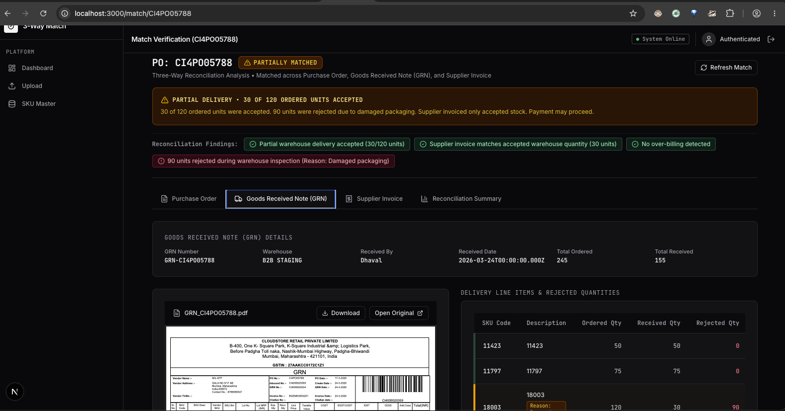
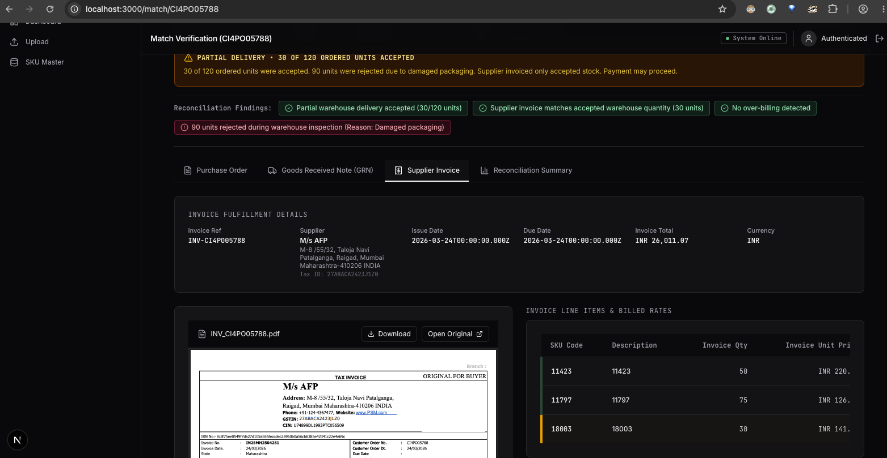
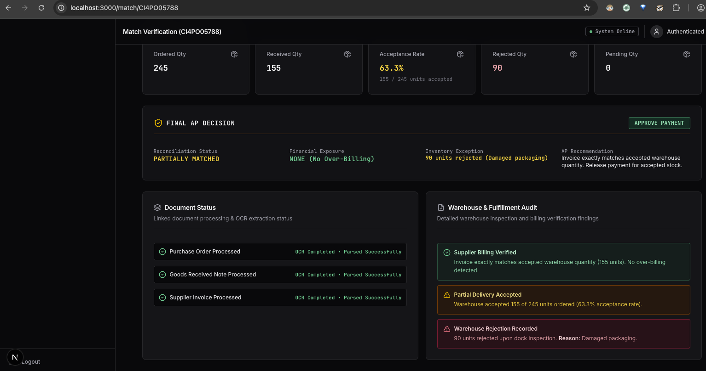

# Three-Way Match Engine - Enterprise AP Frontend Portal


Modern Next.js 16 App Router, TypeScript, Tailwind CSS, Axios, and TanStack Query frontend portal for the Three-Way Match Engine.

---

## 1. Authentication & Credentials

This portal connects to the backend API (`http://localhost:5001`). Default environment login credentials:

- **Username**: `admin`
- **Password**: `admin`

---

## 2. Key Features

- **JWT / Bearer Token Authentication**: Credentials authentication against `POST /auth/login` issuing Bearer tokens attached automatically via Axios interceptors.
- **Authenticated PDF Preview & Streaming**: Fetches protected document binaries via Axios `api.get(url, { responseType: 'blob' })` with `Authorization: Bearer <token>`, generating secure Blob Object URLs (`blob:http://...`).
- **3-Way Match Verification View**: Tabbed document view (PO, Fulfillment/Invoices, Delivery/GRNs, Summary) with mismatch row highlighting and embedded PDF viewer.
- **TanStack Query (React Query v5)**: Automated server state caching, background re-validation, loading/error states, and cache invalidation upon document upload (`queryClient.invalidateQueries`).
- **SKU Master Catalogue**: Complete CRUD management for Stock Keeping Units.
- **Enterprise Dark Mode UI**: Responsive layout inspired by SAP Ariba with high contrast and zero text clipping.

---

## 3. Notes for Reviewer

> [!NOTE]  
> The backend operates in **Mock Mode** (`USE_GEMINI=false`) by default, returning deterministic sample fixture data derived from the assignment PDFs (`CI4PO05788`). This allows offline evaluation without paid AI API keys or credit requirements.

---

## 4. Running Frontend

```bash
# 1. Install dependencies
npm install

# 2. Start development server
npm run dev

# 3. Type check & production build
npm run build

# 4. ESLint audit
npm run lint
```

---

## 5. UI Screenshots & Flow Walkthrough

### Login


### Dashboard


### Upload Documents


### Upload Progress


### SKU Master


### Create SKU


### Purchase Order


### Goods Received Note


### Supplier Invoice


### Match Summary


### Partial Match Audit


### PDF Viewer Controls


### PDF Viewer Fullscreen


### Master Resolution


### Final AP Decision Card


### Warehouse Audit Cards


### Responsive Layout

